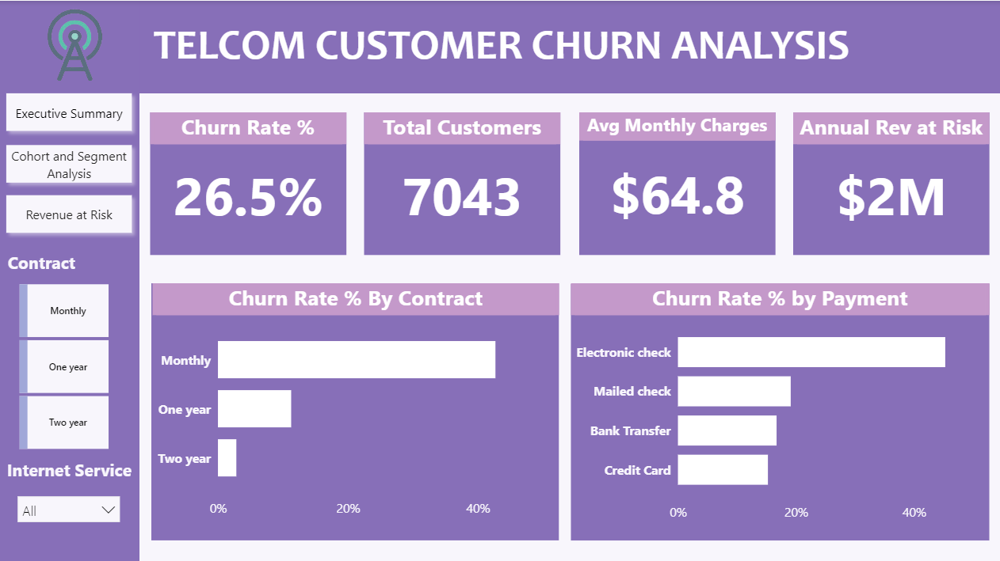
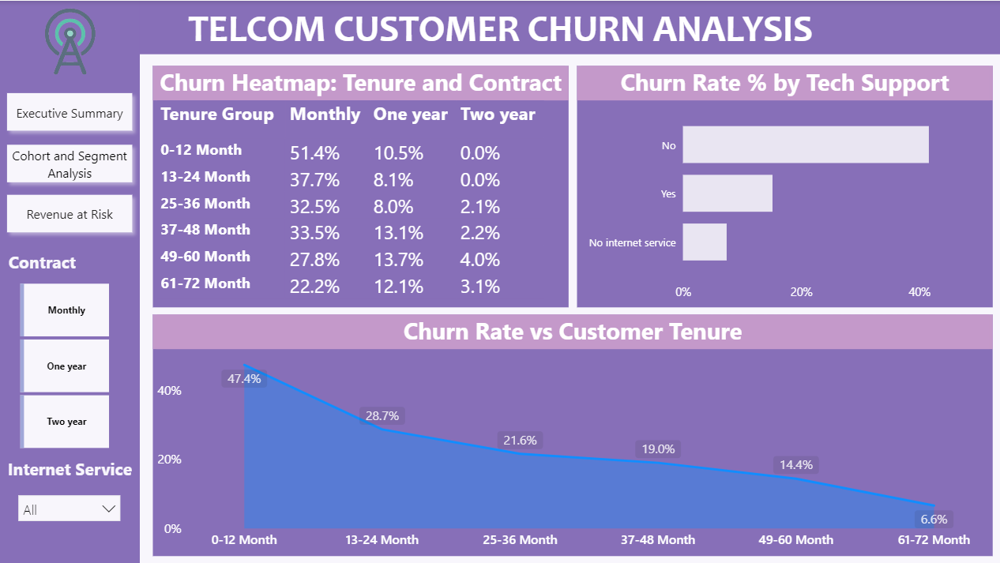
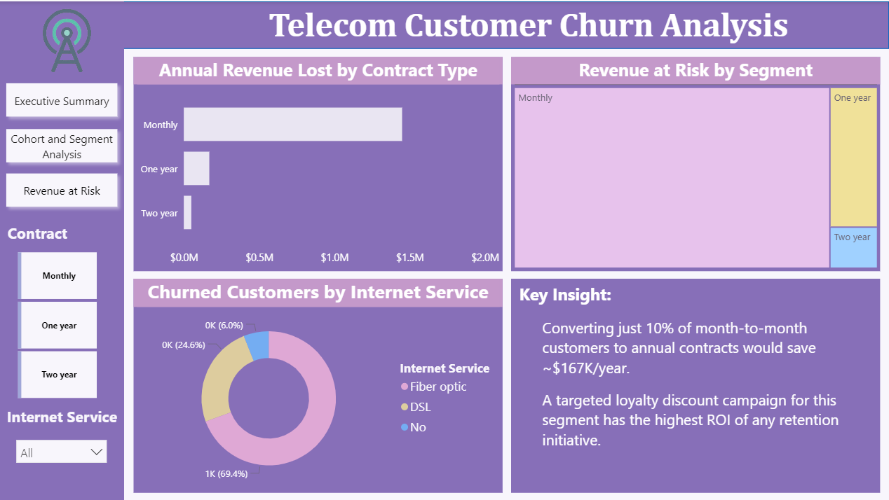

# 📉 Telecom Customer Churn & Cohort Analysis


---

## 🧩 Problem Statement

A telecom company needed to understand **who leaves, when they leave, and why they leave** — to reduce customer churn, improve retention, and protect revenue.

> *"How can the company leverage customer subscription data to identify churn drivers, segment high-risk customers, and design data-backed retention strategies?"*

---

## 💡 Key Findings

| Insight | Finding |
|---|---|
| 👥 Total Customers | **7,043** customers analyzed |
| 📉 Overall Churn Rate | **26.5%** of customers churned |
| 📋 Churned Customers | **1,869** customers lost |
| 💰 Annual Revenue at Risk | **~$1.67M** in yearly recurring revenue at risk |
| 🔴 Highest Risk Contract | Month-to-month — **42.7%** churn rate |
| ✅ Lowest Risk Contract | Two year — **2.8%** churn rate |
| ⚡ Highest Risk Service | Fiber optic — **41.9%** churn rate |
| 🛡️ Best Retention Add-on | Tech Support + Online Security — cuts churn by **~50%** |
| 💳 Riskiest Payment Method | Electronic check — **45.3%** churn rate |
| 🆕 Most Vulnerable Period | First 12 months — **47.7%** churn rate |
| 🔁 Repeat Buyers Not Subscribed | **2,518** loyal buyers never converted to subscribers |

---

## 🗂️ Project Structure

```
📁 telco-churn-cohort-analysis/
│
├── 📓 Data_Cleaning.ipynb               # Python cleaning, EDA & cohort analysis
├── 🗄️ Churn_Analysis_SQL.sql            # 10 business SQL queries (MySQL)
├── 📊 Churn_Dashboard.pbix              # Interactive Power BI dashboard (3 pages)
├── 📄 Project_Report.pdf                # Full written report
├── 📂 images/
│   ├── 🖼️ img1.png                      # Dashboard — Executive Summary
│   ├── 🖼️ img2.png                      # Dashboard — Cohort & Segment Analysis
│   └── 🖼️ img3.png                      # Dashboard — Revenue at Risk
└── 📂 WA_Fn-UseC_-Telco-Customer-Churn.csv   # Raw dataset (7,043 rows)
```

---

## 🔧 Tools & Technologies

| Layer | Tool |
|---|---|
| Data Cleaning & EDA | Python, Pandas, NumPy, Matplotlib, Seaborn |
| Database & Analysis | MySQL / PostgreSQL |
| Visualization | Power BI |
| Reporting | PDF Report |

---

## 📁 Dataset Overview

- **Rows:** 7,043 customer records
- **Columns:** 21 features
- **Source:** [Kaggle — Telco Customer Churn](https://www.kaggle.com/datasets/blastchar/telco-customer-churn)
- **Missing Values:** 11 blank values in `TotalCharges` → imputed with `MonthlyCharges`

| Feature Type | Columns |
|---|---|
| Demographics | Gender, Senior Citizen, Partner, Dependents |
| Subscription Info | Contract Type, Internet Service, Phone Service, Streaming |
| Add-on Services | Tech Support, Online Security, Online Backup, Device Protection |
| Billing | Monthly Charges, Total Charges, Payment Method, Paperless Billing |
| Behavior | Tenure (months), Churn (Yes/No) |

---

## 🐍 Python — Data Preparation & EDA

Performed in `Data_Cleaning.ipynb`:

- **Data Loading:** Imported dataset using Pandas
- **Missing Data Fix:** Converted blank `TotalCharges` strings to numeric; imputed 11 nulls with `MonthlyCharges`
- **Column Standardization:** Renamed all columns to `snake_case`
- **Binary Encoding:** Created `churn_flag` column (Yes → 1, No → 0) for aggregation
- **Feature Engineering:** Created `tenure_group` column — binned tenure into 6 cohorts (0-12 mo, 13-24 mo, 25-36 mo, 37-48 mo, 49-60 mo, 61-72 mo)
- **Cohort Analysis:** Built retention heatmap — churn rate by tenure group × contract type
- **EDA Charts:** Churn by contract, payment method, internet service, add-on services, and tenure group
- **Revenue Calculation:** Quantified annual revenue at risk from churned customers
- **High-Risk Segment:** Identified month-to-month + fiber optic + no tech support segment (58% churn rate)
- **DB Integration:** Exported cleaned DataFrame to PostgreSQL for SQL analysis

---

## 🗄️ SQL — Business Analysis

Performed in `Churn_Analysis_SQL.sql` using MySQL:

1. **Overall Churn KPIs** — 7,043 total | 1,869 churned | 26.5% churn rate | $1.67M annual revenue at risk
2. **Churn Rate by Contract Type** — Month-to-month 42.7% | One year 11.3% | Two year 2.8%
3. **Avg Monthly Charges: Churned vs Retained** — Churned customers pay ~$74/mo vs ~$61/mo for retained
4. **High-Risk Customer Segment** — Month-to-month + Fiber optic + No tech support → 58% churn rate
5. **Revenue at Risk Breakdown** — By contract type and internet service
6. **Long-Tenure Churners (>24 months)** — Customers who stayed 2+ years but still left
7. **Churn Rate by Payment Method** — Electronic check 45.3% | Auto-pay methods ~15-17%
8. **Impact of Add-on Services** — Tech support + security bundle reduces churn by ~50%
9. **Churn by Tenure Group** — 0-12 mo at 47.7% dropping to 4.5% at 61-72 mo
10. **Top Churn Profiles (Window Function)** — ROW_NUMBER() ranks worst customer profiles by churn rate

---

## 📊 Power BI Dashboard

Interactive dashboard with three pages built in `Churn_Dashboard.pbix`:

**KPI Cards:** Total Customers (7,043) · Churn Rate (26.5%) · Annual Rev at Risk (~$1.67M) · Avg Monthly Charge ($64.76) · Retained Customers (5,174)

**DAX Measures Used:**
```
Total Customers    = COUNTROWS(telco_churn)
Total Churned      = SUM(telco_churn[churn_flag])
Churn Rate %       = DIVIDE([Total Churned], [Total Customers], 0) * 100
Monthly Rev Risk   = SUMX(FILTER(telco_churn, telco_churn[churn_flag]=1), telco_churn[monthlycharges])
Annual Rev at Risk = [Monthly Rev Risk] * 12
Avg Monthly Charge = AVERAGE(telco_churn[monthlycharges])
Retained Customers = [Total Customers] - [Total Churned]
```

---

### 📌 Page 1 — Executive Summary


*4 KPI cards, contract type slicer, internet service slicer, churn rate by contract type (bar chart), churn rate by payment method (bar chart).*

---

### 📌 Page 2 — Cohort & Segment Analysis


*Cohort heatmap (Matrix visual with green-to-red gradient) showing churn rate by tenure group × contract type. Churn rate by tenure line chart. Tech support vs churn bar chart.*

---

### 📌 Page 3 — Revenue at Risk


*Annual revenue at risk by contract type (bar chart). Churned customers by internet service (donut chart). Revenue at risk treemap. Key business insight annotation.*

---

## 📌 Business Recommendations

**1. Convert Month-to-Month Customers to Annual Contracts**
Month-to-month customers churn at 42.7% vs 2.8% for two-year contracts. Offer 1-2 months free or a loyalty discount to drive annual plan upgrades. Converting just 10% of this segment saves ~$167K/year.

**2. Build a 90-Day Onboarding Program**
Customers in their first 12 months churn at 47.7% — the highest of any cohort. Assign dedicated onboarding support, proactive check-ins, and a free tech support trial for all new customers.

**3. Bundle Tech Support + Online Security**
Customers with both add-ons churn at ~15% vs ~41% for those with neither. Offer a "Protection Bundle" free for the first 3 months to fiber optic customers — the highest-risk service group.

**4. Migrate Electronic Check Users to Auto-Pay**
Electronic check customers churn at 45.3% vs 15-17% for auto-pay users. Offer a small monthly discount (e.g. 5%) to incentivize switching to automatic bank transfer or credit card payment.

**5. Target Long-Tenure Month-to-Month Customers**
2+ year customers still on month-to-month contracts are high-value retention targets. They stayed long enough to show loyalty but never upgraded. A personalized loyalty offer for this segment has the highest conversion potential.

**6. Proactively Re-engage Repeat Buyers Without Subscriptions**
2,518 customers with 5+ purchases are not subscribed. A targeted re-engagement campaign — email, in-app notification, or a call — focused on this group has direct revenue upside with low acquisition cost.

---

## 👤 Author

**Hamza Anjum**
Data Analyst | Python · SQL · Power BI

<p>
  <a href="https://www.linkedin.com/in/hamza-anjum-459bba320/">
    
  </a>
  &nbsp;
  <a href="https://github.com/Hamza-227">
    
  </a>
  &nbsp;
  <a href="mailto:hamzaanjum650@gmail.com">
    
  </a>
</p>

---

*This project was completed as part of a telecom customer behavior analysis initiative using Python, SQL, and Power BI.*
